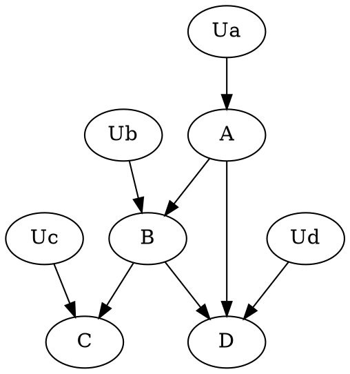

<!-- slide -->
## why we are here
#### since we alive

<!-- slide -->
- [x] @mentions, #refs, [links](), **formatting**, and <del>tags</del> supported
- [x] list syntax required (any unordered or ordered list supported)
- [x] this is a complete item
- [ ] this is an incomplete item

<!-- slide -->
DAG below：
